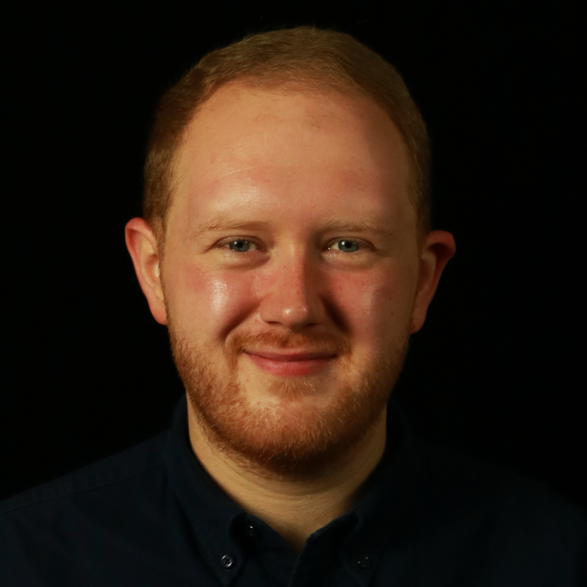

---
# Feel free to add content and custom Front Matter to this file.
# To modify the layout, see https://jekyllrb.com/docs/themes/#overriding-theme-defaults

layout: page
list_title: ' '
---

{: style="float: right" : width="300"}
Hi! My name is James Tanner, and I'm a Research Fellow at the [Centre for Data Science & AI](https://www.gla.ac.uk/research/az/datascience/), [University of Glasgow](https://www.gla.ac.uk/).

My research interests are concerned with how phonetic variation at multiple levels (e.g. across dialects, speakers, and languages) can uncover how phonetic and phonlogical systems are structured, and how this information can provide insight into speech processing (production and perception) and sound change. Inspired by my previous experience in the speech techonology industry, I am also interested in AI speech synthesis models, and how their behaviour and internal representations can be understood from a linguistic and acoustic-phonetic perspective. I have a strong interest in quantitative methods and the statistical modelling of speech and language data, and particularly how we can use statistical models to better understand systems of linguistic variation.

I completed my PhD in the [Department of Linguistics](https://www.mcgill.ca/linguistics/) at McGill University, and completed a [British Academy](https://www.thebritishacademy.ac.uk/) Postdoctoral Fellowship in English Language & Linguistics, University of Glasgow. I also previously developed speech synthesis software at [Resemble AI](https://www.resemble.ai/) and [Amazon](http://amazon.com/), which informs much of my current research interests.

You can find my CV [here](/JamesTannerCV.pdf). Links to data and code used in my projects can be found on my [OSF profile](https://osf.io/53ew8/).